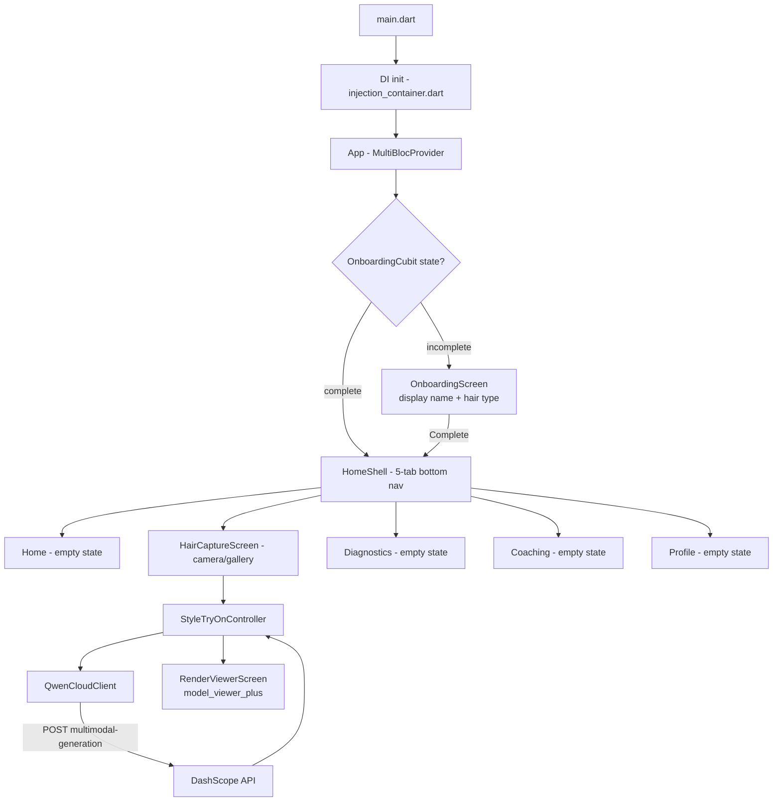

# HairPredict — App Flow & Implementation Status

> Living document. Tracks what has been shipped, what is currently wired up, and what remains to be built end-to-end.
> Last reviewed against `main` on 2026-07-10.

---

## 1. What is HairPredict?

HairPredict is a Flutter (Dart) mobile client for an AI-powered hair health analysis and virtual style try-on experience. It targets the **Qwen AI Hackathon**, specifically:

- **Track 4 — Autopilot Agent**: camera → Qwen Vision → automated workflow (analysis → PDF → WhatsApp coaching).
- **Track 1 — MemoryAgent**: persistent user hair profile that adapts recommendations over time.

The technical narrative is captured in `TECHNICAL.md`. This document tracks **actual implementation progress** vs. that narrative.

---

## 2. High-Level App Flow

---

## 3. Implemented App Flow (Walk-through)

### 3.1 Cold start → Routing
- `lib/main.dart` calls `WidgetsFlutterBinding.ensureInitialized()` then `di.init()` before `runApp(const App())`.
- `lib/injection_container.dart` registers singletons/factories via `get_it`:
  - `SharedPreferences`, `ThemeController`, `OnboardingCubit`, `Connectivity`, `ConnectivityCubit`, `RetryQueue`
  - `StyleTryOnController` (factory), `ProcessCameraImage`, `GenerateHair3DRender` (usecases)
  - `StyleTryOnRepository`, `AuthRepository`, `HairHealthRepository`
  - `Dio` (baseUrl `https://api.qwenhairai.com/v1`) and `QwenCloudClient`
- `lib/app/app.dart` wraps the tree in `MultiBlocProvider` and listens to `ThemeController` to swap light/dark.

### 3.2 Router (`lib/app/router.dart`)
- `GoRouter` with `initialLocation: '/'` and a `redirect` guard driven by `OnboardingCubit.state`:
  - `incomplete` → force `/onboarding`
  - `complete` and at `/onboarding` → redirect to `/home/try-on`
  - `/` always resolves to `/home/home`
- `StatefulShellRoute.indexedStack` provides 5 persistent bottom-nav branches:
  1. `/home/home` → `HomeScreen`
  2. `/home/try-on` → `HairCaptureScreen` (default after onboarding)
  3. `/home/diagnostics` → `DiagnosticsShell` (placeholder)
  4. `/home/coaching` → `CoachingShell` (placeholder)
  5. `/home/profile` → `ProfileScreen` (placeholder)
- `HomeShell` renders the `navigationShell` and a `BottomNavigationBar`.

### 3.3 Onboarding (`lib/app/screens/onboarding/onboarding_screen.dart`)
- Two-step form on a single screen:
  - `DisplayNameField` (text input)
  - `HairTypePicker` (chip selector for HairType enum)
- "Continue" button enabled only when both are set; calls `OnboardingCubit.complete()`.
- Status persists via `SharedPreferences` so a relaunch lands users on `/home/home`.

### 3.4 Style Try-On feature (`lib/features/style_try_on/`)
- **Controller** (`controller/style_try_on_controller.dart`): Cubit holding `idle | capturing | processing | rendered | error` states.
- **Use cases** (`lib/core/usecases/`):
  - `ProcessCameraImage` — wraps image capture/preprocessing.
  - `GenerateHair3DRender` — calls repository, returns a `Hair3DRender` entity.
- **Repositories** (`lib/core/repositories/`):
  - `StyleTryOnRepository` / `_impl` — currently a Dio stub (see §6).
- **Screens**:
  - `CameraScreen` — wraps the `camera` plugin preview.
  - `HairCaptureScreen` — entry point used by the router; allows capture-or-pick.
  - `RenderViewerScreen` — displays the generated render via `model_viewer_plus`.

### 3.5 Network & AI (`lib/core/network/qwen_cloud_client.dart`)
- Two operations backed by DashScope's multimodal-generation endpoint:
  - `analyzeImage(prompt, imageUrl, model: 'qwen3.6-plus')` → returns model text.
  - `generateImage(prompt, model: 'wan2.6-t2i', size: '1280*1280')` → returns image URL.
- Uses `Result<T, Failure>` from `core/errors/failures.dart` (Success/FailureResult), wrapping `DioException` as `ServerFailure`.

### 3.6 Cross-cutting infrastructure
- **Theme**: `AppTheme.light()/dark()`, `ThemeController`, hair-themed palette tokens.
- **Design system**: `tokens/` (spacing, radii, motion, colors, typography, elevations), `components/` (`GradientButton`, `HairBrandAppBar`, `CaptureFrame`, `EmptyState`, `LoadingDots`, `HomeShell`).
- **Connectivity**: `ConnectivityCubit` exposes online/offline to the UI.
- **Retry**: `RetryQueue` interface with `NoopRetryQueue` default (no-op until a backend retry strategy is wired in).
- **Persistence**: only `SharedPreferences` is wired (used for onboarding flag + theme mode). No SQLite/disk cache yet.

### 3.7 Tests
- `test/core/design_system/` — cubits + design tokens (7 tests).
- `test/router/router_test.dart` — onboarding guard redirect.
- `test/widgets/` — capture_frame, empty_state, gradient_button, hair_brand_app_bar, home_shell, loading_dots.

---

## 4. Repository & Module Map

| Layer | Path | Purpose |
|---|---|---|
| App root | `lib/main.dart`, `lib/app/` | Composition root, theme, router, top-level screens |
| Features | `lib/features/style_try_on/` | Camera capture → render flow |
| Domain entities | `lib/core/entities/` | `Hair3DRender`, `StyleImage` |
| Models | `lib/core/models/` | DTOs mirroring API |
| Repositories | `lib/core/repositories/` | `*Repository` interfaces + `_impl` classes |
| Use cases | `lib/core/usecases/` | `ProcessCameraImage`, `GenerateHair3DRender`, `UseCase` base |
| Network | `lib/core/network/` | `QwenCloudClient` |
| Errors | `lib/core/errors/` | `exceptions.dart`, `failures.dart`, `Result<T,F>` |
| Design system | `lib/core/design_system/` | Tokens, components, theme, persistence/connectivity cubits |
| DI | `lib/injection_container.dart` | `get_it` registrations |
| Tests | `test/` | Cubits, widgets, router |

---

## 5. ✅ What Has Been Done

### 5.1 Project foundation
- [x] Flutter project initialized with SDK `^3.11.5`.
- [x] Dependencies pinned (`pubspec.yaml`): `flutter_bloc`, `get_it`, `go_router`, `dio`, `camera`, `image_picker`, `model_viewer_plus`, `connectivity_plus`, `permission_handler`, `shared_preferences`, `app_settings`, `flutter_animate`, `google_fonts`, `path_provider`, `logging`.
- [x] Clean Architecture folder layout (`app/`, `core/{constants,design_system,entities,errors,models,network,repositories,usecases}`, `features/`).
- [x] Result/Either-style error type (`Success` / `FailureResult`).
- [x] Cubits for theme, onboarding, connectivity, retry queue interface.

### 5.2 Design system
- [x] Design tokens: colors, spacing, radii, motion, typography, elevations.
- [x] Hair-themed `AppTheme.light()` / `AppTheme.dark()`.
- [x] Shared components: `GradientButton`, `HairBrandAppBar`, `CaptureFrame`, `EmptyState`, `LoadingDots`, `HomeShell`.
- [x] 5-branch bottom-nav shell with index persistence.

### 5.3 Onboarding
- [x] Display-name + hair-type picker UI.
- [x] `OnboardingCubit` persists `complete` flag to `SharedPreferences`.
- [x] Router redirect enforces onboarding gate.

### 5.4 Style Try-On
- [x] `StyleTryOnController` cubit with full state lifecycle.
- [x] Camera screen (`camera` plugin).
- [x] Image-picker fallback (`image_picker`).
- [x] Render viewer screen using `model_viewer_plus`.
- [x] Use cases (`ProcessCameraImage`, `GenerateHair3DRender`).

### 5.5 AI integration
- [x] `QwenCloudClient.analyzeImage` (multimodal vision).
- [x] `QwenCloudClient.generateImage` (text-to-image / image edit).
- [x] Bearer-token authorization with shared `ApiKeys.qwenCloudApiKey`.

### 5.6 Testing
- [x] Cubit unit tests (onboarding, theme, connectivity).
- [x] Token unit tests (colors, motion, radii, spacing).
- [x] Widget tests for shared components.
- [x] Router redirect test.

---

## 6. 🚧 What Is Wired Up but Stubbed

These compile and route, but their real behavior is incomplete or relies on infrastructure that does not yet exist:

- [ ] **`AuthRepository` / `AuthRepositoryImpl`** — registered in DI but not consumed anywhere; no auth screens, no token refresh, no protected routes.
- [ ] **`HairHealthRepository`** — only `getDiagnosticsReport()` against `/hair-health/diagnostics`; no upload, no PDF fetch, no history.
- [ ] **`StyleTryOnRepositoryImpl`** — wraps Dio against the configured base URL but no endpoints are implemented; currently only direct `QwenCloudClient` calls happen.
- [ ] **`HomeShell` bottom nav** — `try-on` is the post-onboarding landing tab, but `home`, `diagnostics`, `coaching`, `profile` are all `EmptyState` placeholders.
- [ ] **`RetryQueue`** — only a `NoopRetryQueue` exists; no persistent retry queue backing failed Qwen jobs.
- [ ] **Backend `https://api.qwenhairai.com/v1`** — base URL is configured but no live API is documented or deployed from this repo.

---

## 7. ❌ What Is Left To Be Done

Prioritized by user-visible impact, then by infrastructure.

### 7.1 Critical (security & correctness)
1. **🔴 Remove hardcoded API key.** `lib/core/constants/api_keys.dart` ships a live DashScope key in source. Move to `--dart-define`, a `.env` file (e.g. `flutter_dotenv`), or a secrets broker; add `.env*` to `.gitignore`; rotate the leaked key.
2. **🔴 `OnboardingCubit.complete()` does not persist name or hair type.** It only flips a flag. Persist `displayName` and `HairType` to `SharedPreferences` (or a user profile entity) and expose them.
3. **🔴 Image upload pipeline.** `QwenCloudClient.analyzeImage` requires an `imageUrl` string, but the camera/picker flow captures a local file. Add an upload step (signed URL, S3/OSS, or DashScope file upload) and pass the returned URL through.
4. **🟠 Camera permission UX.** No runtime permission rationale UI; verify `permission_handler` is invoked and gracefully handled when denied.
5. **🟠 Camera initialization on iOS.** `Info.plist` `NSCameraUsageDescription` not yet confirmed in `ios/`; Android `CAMERA` permission needs to be verified in `android/app/src/main/AndroidManifest.xml`.

### 7.2 Feature work — by tab

**Home (`/home/home`)**
- [ ] Personalized greeting using persisted display name.
- [ ] Recent scans list (last 3 renders with thumbnail + timestamp).
- [ ] Upcoming routine card driven by Coaching data.
- [ ] Quick-action CTA → `/home/try-on`.

**Try-On (`/home/try-on`)**
- [ ] Replace stub `StyleTryOnRepository` with a real flow that:
  1. Uploads the captured image.
  2. Calls `QwenCloudClient.analyzeImage` to extract hair attributes.
  3. Calls `QwenCloudClient.generateImage` (or image-edit) with a style prompt.
  4. Returns a `Hair3DRender` URL to the viewer.
- [ ] Loading + error states wired through `StyleTryOnController`.
- [ ] Style presets library (locs, twists, braids, fades, color overlays) selectable before generation.
- [ ] Save/share the rendered image to gallery.

**Diagnostics (`/home/diagnostics`)**
- [ ] Replace placeholder with the Qwen Vision analysis output (texture map, health score, chemical-impact prediction).
- [ ] PDF dossier generation/download (PDFKit is referenced server-side; on-device rendering via `pdf` + `printing` packages is an alternative).
- [ ] Timeline of past scans.

**Coaching (`/home/coaching`)**
- [ ] WAHA-backed WhatsApp opt-in screen and chat history.
- [ ] Daily routine push cards.
- [ ] Two-way message bridge via n8n workflow.

**Profile (`/home/profile`)**
- [ ] Display name + hair type editing.
- [ ] Chemical-treatment history form.
- [ ] Routine preferences toggles.
- [ ] Sign-out (once auth exists).

### 7.3 Infrastructure
- [ ] Replace `NoopRetryQueue` with a persistent queue (e.g. `hive` / `drift` / `sqflite`) so failed Qwen jobs retry with exponential backoff.
- [ ] Local disk cache for previously generated renders (`path_provider` + `cached_network_image`).
- [ ] Logging pipeline — wire `package:logging` to a sink (developer log + remote error reporting).
- [ ] Crash reporting (Sentry/Crashlytics).
- [ ] Analytics events (Mixpanel/Amplitude/PostHog) for capture → generate → save funnel.
- [ ] i18n / l10n setup.
- [ ] Localization copy beyond English.

### 7.4 Backend (outside this repo, but blocking)
- [ ] Ship the Node.js + Express API at `https://api.qwenhairai.com/v1` with at minimum:
  - `POST /uploads` (returns hosted URL)
  - `POST /style-try-on` (enqueues BullMQ job → Qwen)
  - `GET /hair-health/diagnostics`
  - `GET /hair-health/diagnostics/:id/pdf`
  - `GET /coaching/routines`
- [ ] BullMQ workers + Redis.
- [ ] n8n workflow + WAHA integration for WhatsApp coaching.
- [ ] PDFKit dossier generator.
- [ ] Swagger / OpenAPI spec.

### 7.5 Quality & release
- [ ] Increase test coverage: repositories (mocked Dio), controller (state transitions), use cases.
- [ ] Integration test for the capture → render happy path.
- [ ] Golden tests for empty states and app bar.
- [ ] `flutter analyze` clean; remove the placeholder `analysis_options.yaml` content if it is empty.
- [ ] CI: GitHub Actions workflow running `flutter analyze`, `flutter test`, and `flutter build apk --debug` on PRs.
- [ ] Release build pipelines (Play Store internal track, TestFlight).
- [ ] Versioning + changelog discipline.
- [ ] README overhaul (currently just `A new Flutter project.`).
- [ ] Architecture decision records (ADRs) for: Qwen client, retry strategy, persistence layer.

---

## 8. Risks & Open Questions

1. **Is there a live backend at `api.qwenhairai.com`?** If not, every `Dio` call hitting that base URL currently fails. Confirm scope: does this Flutter app talk only to DashScope directly, or always through a backend?
2. **Image generation policy.** DashScope's `wan2.6-t2i` model — is image-edit (inpainting on the user's face photo) available, or do we need a different model like `qwen-image-edit`?
3. **3D rendering path.** `model_viewer_plus` implies a `.glb` / `.gltf` asset. Is the backend producing 3D assets, or is the "3D render" actually a 2D image displayed in the viewer?
4. **Privacy.** Hair photos are sensitive. Need consent flow + retention policy + on-device redaction option.
5. **Offline behavior.** Connectivity cubit exists but there is no offline queue yet. Define offline UX policy.

---

## 9. Suggested Execution Order

1. **Security hardening**: rotate the leaked API key and move it out of source.
2. **Persistence**: finish onboarding persistence (name + hair type), add a `UserProfile` entity.
3. **Real upload pipeline**: signed-URL upload so `analyzeImage` can be called end-to-end.
4. **Wire the Style Try-On flow against real Qwen calls** with proper loading/error states.
5. **Build out Diagnostics tab** (highest visible value after try-on).
6. **Build out Home tab** with real data.
7. **Coaching (WAHA) + Profile editing** together — both depend on `UserProfile` being complete.
8. **Retry queue, crash reporting, analytics** in parallel.
9. **CI, golden tests, integration test**.
10. **Release pipeline + store listings**.

---

## 10. Status Snapshot

| Area | Status |
|---|---|
| App shell + navigation | ✅ Done |
| Theme + design system | ✅ Done |
| Onboarding UI + gate | ⚠️ UI done, persistence incomplete |
| Camera + image picker | ⚠️ Wired, no permission UX polish |
| Qwen Vision client | ✅ Implemented (key must be moved) |
| Qwen image generation client | ✅ Implemented (key must be moved) |
| Style Try-On happy path | ❌ Not wired to real backend |
| Home tab | ❌ Empty state |
| Diagnostics tab | ❌ Empty state |
| Coaching / WhatsApp | ❌ Empty state |
| Profile | ❌ Empty state |
| Auth | ❌ Repo stub only |
| Local disk cache / SQLite | ❌ Not started |
| Retry queue | ❌ Noop only |
| Crash reporting / analytics | ❌ Not started |
| CI/CD | ❌ No GitHub Actions workflows |
| Tests | ⚠️ Cubits + widgets + router; no repo/controller coverage |
| Backend (separate repo) | ❌ Referenced in code, no service here |
